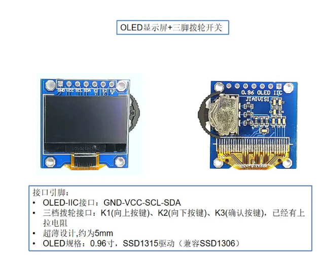

# NanoTimer (PicoChrono)

[](https://www.raspberrypi.com/products/raspberry-pi-pico/)
[](LICENSE)

中文 | [English](README.md)

PicoChrono 是基于 **Waveshare RP2040-Zero** 的紧凑型桌面时钟：**DS3231** RTC、带拨轮的 **SSD1306** 128×64 OLED、USB 串口校时。固件模式：**时钟**、**日历**、**秒表**。

---

## 功能特性

- DS3231 高精度走时（±2 ppm），可读芯片温度
- OLED 顶栏日期/星期/温度 + 七段数码管 `HH:MM:SS`
- 月历界面，RTC 当天反色高亮
- 秒表运行中显示百分秒
- USB CDC 校时，写入带电池 RTC 掉电仍走时
- 拨轮三键去抖 K1 / K2 / K3

## 硬件

### 系统架构

```
                    ┌─────────────────────────┐
                    │   Waveshare RP2040-Zero │
                    └───────────┬─────────────┘
            I2C0 (GP4/GP5)    │    I2C1 (GP14/GP15)
                    ┌─────────┴─────────┐
              ┌─────▼─────┐      ┌──────▼──────┐
              │  DS3231   │      │ OLED + 拨轮 │
              └───────────┘      │ K1/K2/K3    │
                    │            └─────────────┘
              3.3V / GND            3.3V / GND
```

| 部件 | 规格 |
|------|------|
| 主控 | Waveshare RP2040-Zero（USB-C；GP16 板载 WS2812，未使用） |
| RTC | DS3231，I2C **0x68**，建议 CR2032 电池 |
| 显示+输入 | 0.96" SSD1315/SSD1306 128×64，I2C **0x3C**；K1/K2/K3 板载上拉 |

**供电：** 全部 **3.3 V**、**GND** 共地；逻辑脚勿接 5 V。DS3231 装 CR2032 后 USB 断电仍走时。

**接线**

| 信号 | GPIO | 总线 / 说明 |
|------|------|-------------|
| DS3231 SDA / SCL | GP4 / GP5 | I2C0 @ 100 kHz |
| OLED SDA / SCL | GP14 / GP15 | I2C1 @ 400 kHz |
| K1 / K2 / K3（上 / 下 / 确认） | GP6 / GP7 / GP8 | 低电平有效 |

OLED 模块 7 针顺序：**GND · VCC · SCL · SDA · K1 · K2 · K3**

引脚图：[`docs/RP2040_Zero.png`](docs/RP2040_Zero.png)、[`docs/OLED_SSD1306_0.96inch.png`](docs/OLED_SSD1306_0.96inch.png)



固件引脚定义：`include/board/board_config.hpp`（`BOARD_DS3231_*`、`BOARD_SSD1306_*`、`BOARD_KEY_*`）。从 `ssd1306` 或 `DS3231_Clock` 移植时须替换 I2C 与 GPIO，勿直接复制其 `#define`。

**显示布局（128×64）：** 顶栏约 20 px 显示日期/星期/温度；主区为时钟、日历或秒表。时钟区为 14×28 px 七段数码管。

## 软件

```
apps/picochrono/main.cpp     入口，10 ms 主循环
src/app/       AppController  模式与事件路由
src/ui/        视图           clock / calendar / stopwatch
src/services/  秒表
src/sync/      USB 校时       (usb_time_sync.cpp)
src/input/     按键去抖       (key_input.cpp)
src/hal/       板级初始化
src/util/      日历工具
lib/ds3231, lib/ssd1306       驱动
```

每次 `AppController::tick()`：USB 校时 → 按键 → RTC 秒变化 → 按需刷新。

| 模式 | 刷新 | 按键 |
|------|------|------|
| 时钟 | RTC 秒变化 | K3 → 日历 |
| 日历 | 秒变化或翻月 | K1/K2 翻月；K3 → 秒表 |
| 秒表 | 运行中 50 ms | K3 开始/暂停；长按清零；K1 → 时钟 |

按键为数字输入（非编码器）；去抖 30 ms；短按 20–900 ms；长按 ≥ 800 ms。

| 扩展 | 位置 |
|------|------|
| 新界面 | `src/ui/` + `AppMode` |
| 新外设 | `lib/` + `src/hal/` |
| 改引脚 | `board_config.hpp` |

## 编译与烧录

需 [Pico SDK](https://github.com/raspberrypi/pico-sdk) 与 `PICO_SDK_PATH`。

```batch
build_pico.bat
```

或：`mkdir build && cd build && cmake -G Ninja .. && ninja` → 烧录 `build/picochrono.uf2`。

## USB 串口校时

非阻塞解析见 `src/sync/`。USB 虚拟串口（115200）发送一行并回车：

| 格式 | 示例 |
|------|------|
| 时分秒 | `14:30:00` |
| 日期+时间 | `2026-05-23 14:30:00` |
| ISO | `2026-05-23T14:30:00` |

年份 2000–2099，须为合法日期。API：`usb_sync_poll_line(rtc, out)` → 1 成功，0 未完成，−1 错误。首次上电 OSF 置位时需先校时。

## 驱动（速查）

**SSD1306** — `lib/ssd1306/`

```cpp
SSD1306 oled(i2c1, 0x3C);
oled.begin();
oled.setContrast(0x8F);
oled.clearDisplay();
oled.print("Hello");
oled.display();   // 必须调用才显示
```

有内容不显示：检查是否调用 `display()`。`begin()` 失败：查接线与 I2C 初始化。

**DS3231** — `lib/ds3231/`

```c
ds3231_init(&rtc, i2c0, 4, 5);
ds3231_read_time(&rtc, &now);
```

星期 `day` 为 1–7（**1=星期日**），数组索引用 `day - 1`。界面以 RTC **秒变化** 刷新，勿软件累加走时。API：`ds3231_read_time`、`ds3231_write_time`、`ds3231_read_temperature`、`ds3231_is_oscillator_stopped`。

## 外部参考

| 项目 | 用途 |
|------|------|
| `ssd1306` | OLED/RTC 驱动、时钟 UI |
| `DS3231_Clock` | USB 校时 |

## 许可证

MIT — 见 [LICENSE](LICENSE)。
